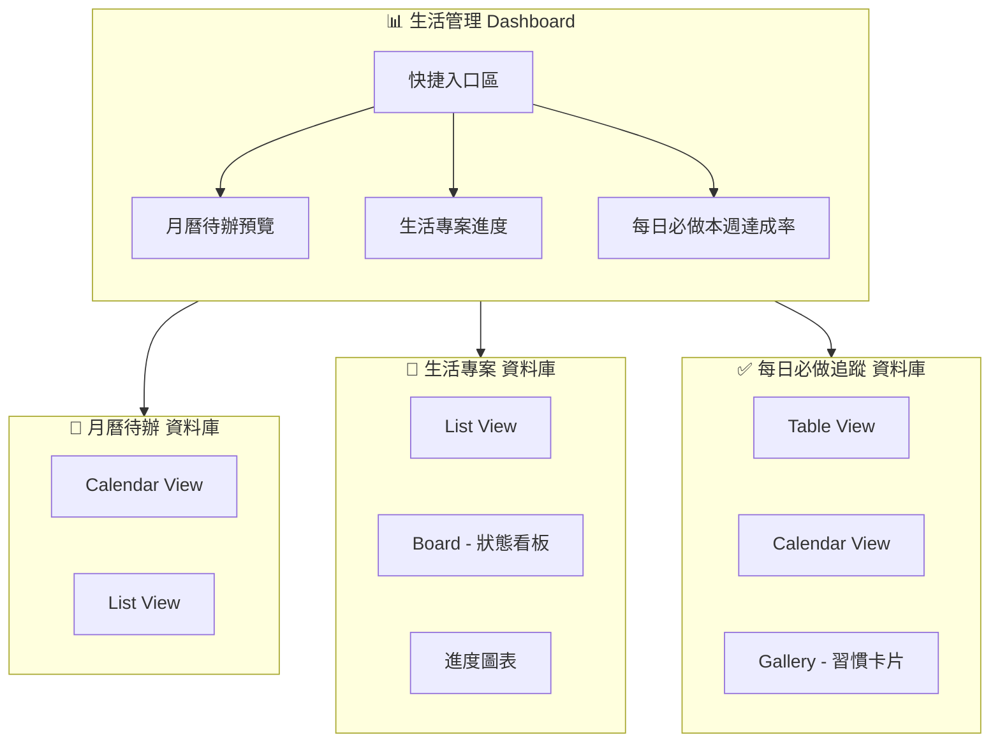

# 生活管理 Notion 模板設計

本文件提供一套完整的 Notion 模板架構設計，用於管理日常生活、專案進度與每日習慣追蹤。可直接依此架構在 Notion 中建立你的個人系統。

## 目錄

- [1. 概述](#1-概述)
- [2. 整體架構](#2-整體架構)
- [3. Dashboard 設計](#3-dashboard-設計)
- [4. 子模塊資料庫規格](#4-子模塊資料庫規格)
- [5. 資料庫關聯與自動化](#5-資料庫關聯與自動化)
- [6. 建立步驟清單](#6-建立步驟清單)

---

## 1. 概述

此模板由一個 **Dashboard（總控頁）** 串接三個核心資料庫：「月曆待辦」、「生活專案」、「每日必做追蹤」。三者可獨立運作，亦可透過關聯欄位串接，實現跨模塊的資料聯動。

| 模塊 | 用途 | 核心視圖 |
|------|------|----------|
| 月曆待辦 | 記錄每日代辦事項 | 月曆 (Calendar) |
| 生活專案 | 管理多日專案與進度 | 列表 + 進度條圖表 |
| 每日必做 | 習慣達成打卡 | 表格 + 月曆/畫廊 |

---

## 2. 整體架構



---

## 3. Dashboard 設計

### 3.1 頁面結構

建立一個新頁面「生活管理 Dashboard」，建議結構如下：

| 區塊順序 | 區塊名稱 | 內容 | 說明 |
|----------|----------|------|------|
| 1 | 歡迎標題 | 簡短標語（如：本週重點、本月目標） | 可搭配 Callout 或 Quote |
| 2 | 快捷入口 | 三個按鈕/連結，分別連結到三個子資料庫 | 使用 `/link` 或 `/button` |
| 3 | 本週待辦預覽 | 內嵌月曆待辦的 Calendar View，篩選本週 | `/embed` 月曆資料庫 |
| 4 | 生活專案進度 | 內嵌生活專案的 List View，顯示進行中專案 | 可用進度條或狀態篩選 |
| 5 | 每日必做達成率 | 內嵌每日必做的 Table View，顯示本週/本月達成 | 可配合篩選與排序 |

### 3.2 快捷入口範例

```
[📅 今日待辦] → 月曆待辦資料庫（預設顯示今日）
[📁 生活專案] → 生活專案資料庫（篩選進行中）
[✅ 每日必做] → 每日必做追蹤資料庫（篩選今日）
```

---

## 4. 子模塊資料庫規格

### 4.1 月曆待辦（Calendar To-Do）

**資料庫類型**：Full-page database（全頁資料庫）

| 欄位名稱 | 類型 | 說明 |
|----------|------|------|
| 名稱 | Title | 待辦事項名稱 |
| 日期 | Date | 預設顯示在月曆上，支援時間與全天選項 |
| 優先級 | Select | 高 / 中 / 低（可自訂顏色） |
| 狀態 | Select | 未開始 / 進行中 / 已完成 |
| 所屬專案 | Relation | 關聯到「生活專案」資料庫（選填） |
| 備註 | Text | 補充說明 |
| 完成日期 | Date | 可選，用於記錄實際完成時間 |

**建議視圖：**

| 視圖名稱 | 類型 | 篩選/排序 |
|----------|------|-----------|
| 月曆 | Calendar | 以「日期」為顯示日期 |
| 本週清單 | Table/List | 篩選：日期在本週，排序：日期升序 |
| 未完成 | Table/List | 篩選：狀態 ≠ 已完成 |

---

### 4.2 生活專案（Life Projects）

**資料庫類型**：Full-page database

| 欄位名稱 | 類型 | 說明 |
|----------|------|------|
| 專案名稱 | Title | 專案主題名稱 |
| 狀態 | Select | 尚未開始 / 進行中 / 暫停 / 已完成 |
| 進度 | Number | 0–100 的百分比，用於進度條 |
| 開始日期 | Date | 專案開始日 |
| 目標完成日 | Date | 預計完成日 |
| 實際完成日 | Date | 選填，真正完成時記錄 |
| 專案描述 | Text | 專案目的、範圍簡述 |
| 待辦事項 | Relation | 關聯到「月曆待辦」，顯示此專案下的待辦 |
| 子任務 | 子項目 / 內嵌待辦 | 可在此專案頁內建立子任務清單 |

**建議視圖：**

| 視圖名稱 | 類型 | 用途 |
|----------|------|------|
| 全部專案 | Table | 預設，含進度條、狀態 |
| 狀態看板 | Board | 以「狀態」分欄，拖拉管理 |
| 進度追蹤 | Table | 排序：進度降序，篩選進行中 |
| 時間軸 | Timeline | 以開始/目標完成日顯示（若有 Timeline 功能） |

**進度統計方式：**

1. **手動更新**：在「進度」欄位直接輸入 0–100
2. **關聯待辦計算**：透過 Relation 到月曆待辦，可建立 Rollup 計算「已完成待辦數 / 總待辦數」作為進度參考
3. **圖表**：使用 Notion 內建或嵌入外部圖表（如 Google Sheets）呈現多專案進度對比

---

### 4.3 每日必做追蹤（Daily Habits Tracker）

**資料庫類型**：Full-page database

| 欄位名稱 | 類型 | 說明 |
|----------|------|------|
| 習慣名稱 | Title | 如：喝水量 2L、11 點前睡覺 |
| 日期 | Date | 記錄的日期（每日一筆或多筆，依設計） |
| 達成 | Checkbox | 是否達成，打勾表示完成 |
| 數值紀錄 | Number | 選填，如實際喝水量（ml）、睡覺時間（24hr 制） |
| 備註 | Text | 選填 |
| 習慣類型 | Select | 健康 / 作息 / 學習 / 運動 / 其他 |

**資料結構兩種設計選擇：**

**方案 A：每日每習慣一列**

- 每條記錄 = 某日 + 某習慣 + 是否達成
- 優點：容易篩選、統計單一習慣的達成率
- 缺點：每天需新增多筆（可用 Template 批次建立）

**方案 B：每月一頁 + 表格**

- 建立「每月習慣追蹤」頁面，內嵌一個 Table，列為日期、行為習慣名稱（如喝水、睡覺）
- 優點：一頁看清整月，類似 habit tracker 手帳
- 缺點：需每月手動建立新頁

**推薦：方案 A**，搭配 Database Template 簡化輸入。

**範例 Database Template：**

建立「今日習慣打卡」Template，預填：
- 日期：Today（或手選）
- 習慣名稱：從常用習慣中選
- 達成：留空待勾選

可建立多個預設習慣的 Template 按鈕，一鍵新增今日記錄。

**建議視圖：**

| 視圖名稱 | 類型 | 篩選 |
|----------|------|------|
| 本月追蹤 | Table | 日期在本月，分組：習慣名稱 |
| 日曆視圖 | Calendar | 以日期顯示，可看哪天有達成記錄 |
| 本週達成率 | Table | 篩選本週，按習慣名稱分組，顯示達成數 |
| 習慣卡片 | Gallery | 以習慣名稱為卡片標題，內嵌該習慣的達成記錄 |

---

## 5. 資料庫關聯與自動化

### 5.1 關聯設計

```
月曆待辦.所屬專案 ←→ 生活專案.待辦事項
```

- **月曆待辦** 的「所屬專案」關聯到 **生活專案**
- **生活專案** 的「待辦事項」為反向關聯，顯示該專案下所有待辦

好處：在專案頁可直接看到相關待辦，完成待辦時可選擇歸屬專案。

### 5.2 進度自動化（進階）

若希望「生活專案」的進度自動依關聯待辦計算：

1. 在「生活專案」新增 Rollup 欄位
2. 來源：待辦事項（Relation）
3. 計算：Count all（或 Count values）  
4. 可建立兩個 Rollup：總待辦數、已完成待辦數
5. 進度公式：`prop("已完成數") / prop("總數") * 100`（需 Notion Formula）

注意：Notion 公式有侷限，若「已完成」需透過狀態篩選，可能需手動維護進度或使用 Notion 自動化（若有的話）。

---

## 6. 建立步驟清單

依照以下順序在 Notion 中實作：

### Phase 1：建立資料庫

1. [ ] 建立「月曆待辦」資料庫，新增上述欄位
2. [ ] 建立「生活專案」資料庫，新增上述欄位
3. [ ] 建立「每日必做追蹤」資料庫，新增上述欄位

### Phase 2：建立關聯

4. [ ] 在月曆待辦新增「所屬專案」Relation → 生活專案
5. [ ] 確認生活專案自動出現「待辦事項」反向關聯

### Phase 3：建立視圖

6. [ ] 月曆待辦：建立 Calendar view、本週 List view
7. [ ] 生活專案：建立 Table、Board、進度追蹤 view
8. [ ] 每日必做：建立 Table、Calendar、Gallery view

### Phase 4：建立 Dashboard

9. [ ] 建立「生活管理 Dashboard」頁面
10. [ ] 放入快捷入口、嵌入三個資料庫的對應視圖
11. [ ] 設定各嵌入視圖的篩選（本週、今日等）

### Phase 5：優化

12. [ ] 為每日必做建立 Database Template，方便快速打卡
13. [ ] 為生活專案建立專案頁 Template（含描述、子任務結構）
14. [ ] 視需求加入 Icon、Cover 美化

---

## 附錄：每日必做範例清單

可預先建立的習慣項目參考：

| 習慣名稱 | 類型 | 達成條件 |
|----------|------|----------|
| 喝水量 2L | 健康 | 達成打勾，或記錄實際 ml |
| 11 點前睡覺 | 作息 | 達成打勾 |
| 運動 30 分鐘 | 運動 | 達成打勾 |
| 閱讀 30 分鐘 | 學習 | 達成打勾 |
| 冥想 10 分鐘 | 健康 | 達成打勾 |

可依個人需求調整，並在 Database Template 中預設這些選項。
