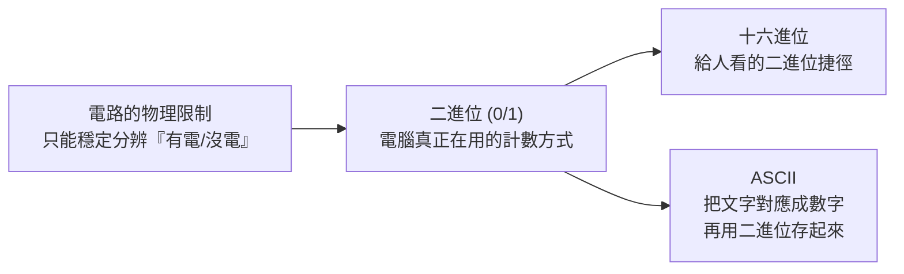

# 二進位、十進位、十六進位與 ASCII

這份讓你合上檔案後，能自己講清楚：電腦為什麼只用 0 和 1、十六進位是給誰看的、以及文字是怎麼被存成數字的。這是課外延伸，不對應任何一門課的進度。

## 目錄

- [1. 這在解決什麼問題](#1-這在解決什麼問題)
- [2. 一句人話](#2-一句人話)
- [3. 用例子看一遍](#3-用例子看一遍)
- [4. 理論怎麼運作](#4-理論怎麼運作)
- [5. 什麼時候能用、什麼時候不能用](#5-什麼時候能用什麼時候不能用)
- [6. 跟你已學過的概念怎麼接](#6-跟你已學過的概念怎麼接)
- [7. 確認你學會了](#7-確認你學會了)
- [8. 來源](#8-來源)
- [想看推導再讀](#想看推導再讀)

## 1. 這在解決什麼問題

你每天在螢幕上看到的中英文字、數字、符號，在電腦裡面其實只有一種東西：電路裡「有沒有通電」。硬體工程師發現，要造出一個能穩定分辨「10 種不同電壓高低」的元件很難、很貴，也容易出錯；但要造一個只需要分辨「有電／沒電」兩種狀態的元件（電晶體、開關），既便宜又可靠。

於是整台電腦從底層開始，就只認得兩個符號：0 跟 1。這就是**二進位（binary）**存在的原因——不是數學家覺得它比較優雅，是硬體的物理限制逼出來的選擇。

但「只有 0 跟 1」對人類很不友善：一個位元組要寫成 `01001000`，八個字才讀懂一個數字，人很容易數錯位數。所以工程師發明了**十六進位（hexadecimal）**當作「給人看的簡寫」，讓又長又難讀的二進位可以濃縮成短短幾碼。

那「文字」呢？電腦既然只認得數字，若要存「A」這個字，就得先講好一套規則：「數字幾號對應到字母 A」。這套規則就是 **ASCII**。三個問題其實是同一條線：電路只懂二進位 → 十六進位是給人看的二進位捷徑 → ASCII 是把文字翻譯成數字、再用二進位存起來的對照表。

## 2. 一句人話

- **進位制（number base / numeral system）**：一套「用幾個符號一輪、滿了就往左邊進一位」的計數規則。十進位（decimal）滿 10 進位、用 0–9 十個符號；二進位（binary）滿 2 進位、只用 0、1 兩個符號；十六進位（hexadecimal）滿 16 進位、用 0–9 加 A–F 十六個符號。
- **ASCII（American Standard Code for Information Interchange）**：一張固定的對照表，把英文字母、數字、標點符號，各自綁定一個 0 到 127 的整數編號。電腦存「A」這個字時，實際存的是數字 65（用二進位寫成 `01000001`）。

## 3. 用例子看一遍

### 進位制：用「湊滿一組就換一個籃子」來想

假設你在數蘋果，規定「湊滿 10 顆就換成 1 個大籃子，籃子湊滿 10 個再換 1 個大貨櫃」——這就是十進位，數字 123 的意思是「1 個大貨櫃、2 個大籃子、3 顆散裝蘋果」。

現在改規則：「湊滿 2 顆就換 1 個小籃子，小籃子湊滿 2 個再換 1 個中籃子，中籃子湊滿 2 個再換 1 個大籃子……」，一路只用「滿 2 就進位」。這就是二進位。二進位數字 `1011` 拆開讀：從右邊數來第 0 位是 1、第 1 位是 1、第 2 位是 0、第 3 位是 1，換算成你熟悉的十進位就是 8 + 0 + 2 + 1 = **11**。

十六進位則是「湊滿 16 顆才換一個籃子」，符號不夠用（人類手寫數字只有 0–9），所以借用字母 A、B、C、D、E、F 代表 10、11、12、13、14、15。十六進位的 `2F`，換算成十進位是 2×16 + 15 = **47**。

### ASCII：像一本「文字對照密碼本」

你傳一則簡訊「Hi」給朋友，手機背後做的事情是：查表發現 `H` 對應數字 72、`i` 對應數字 105，把這兩個數字（各自用二進位存成一個位元組）送出去；對方手機收到後，用同一本對照表反查回來，螢幕才顯示出「Hi」兩個字母。你們看到的是文字，電腦傳的自始至終是數字。

## 4. 理論怎麼運作

### 位值系統：進位制的正式定義

任何一個進位制都是「位值系統（positional numeral system）」：一個數字每一位上的符號，乘上「底數（base, b）的次方」再加總。第 i 位（從右邊數、從 0 開始）的權重是 \(b^i\)。

以十進位（b = 10）的 345 為例：
\[
345 = 3 \times 10^2 + 4 \times 10^1 + 5 \times 10^0
\]
每一位的人話：個位是「1 的份量」、十位是「10 的份量」、百位是「100 的份量」——這是你從小用到大、已經內化到沒感覺的規則。二進位、十六進位只是把 10 換成別的底數，規則完全一樣。

以二進位（b = 2）的 `1011` 為例：
\[
1011_2 = 1\times2^3 + 0\times2^2 + 1\times2^1 + 1\times2^0 = 8+0+2+1 = 11_{10}
\]

以十六進位（b = 16）的 `2F` 為例：
\[
2F_{16} = 2\times16^1 + 15\times16^0 = 32+15 = 47_{10}
\]

**為什麼十六進位特別方便換算二進位**：\(16 = 2^4\)，剛好是二進位 4 位（稱為一個 nibble）能表示的範圍（0000–1111）。所以每 4 個二進位位數，對齊剛好可以濃縮成 1 個十六進位符號，換算時不用整串重算，用眼睛分四格對照就好：

| 二進位（4 位一組） | 十六進位 |
| --- | --- |
| 0000 | 0 |
| 0101 | 5 |
| 1010 | A |
| 1111 | F |

例如 `10110010`，切成 `1011` `0010`，對照表得到 `B` `2`，答案是十六進位 `B2`——不必先換算成十進位再繞回去。這也是為什麼工程師顯示記憶體位址、顏色代碼（如網頁色碼 `#FF5733`）都愛用十六進位：它是二進位的「人類可讀壓縮版」，不是另一套獨立系統。

**進位制互換的通用做法（十進位 → 其他進位）**：反覆用目標底數去除，把每次的餘數由下往上排列。例如把 11 換成二進位：11÷2=5 餘 1、5÷2=2 餘 1、2÷2=1 餘 0、1÷2=0 餘 1，餘數由下往上讀是 `1011`，跟前面驗證一致。

### ASCII：文字如何被翻譯成數字

ASCII 用 **7 個二進位位元**（bit）表示一個字，所以範圍是 \(0\) 到 \(2^7-1=127\)，總共 128 個編號夠涵蓋大小寫英文字母、數字 0–9、常用標點，以及一批「控制碼」（不會印出來的指令，例如換行、響鈴，早期用來控制電傳打字機）。

編號分區大致是（不用背，理解「有規律」比背數字重要）：

| 範圍 | 內容 | 例子 |
| --- | --- | --- |
| 0–31 | 控制碼（不可見） | 10 = 換行（LF） |
| 32–126 | 可印出的字元 | 32 = 空白鍵 |
| 48–57 | 數字字元 '0'–'9' | 48 = '0' |
| 65–90 | 大寫英文字母 A–Z | 65 = 'A' |
| 97–122 | 小寫英文字母 a–z | 97 = 'a' |

**為什麼這樣定義**：這批編號在 1960 年代由美國標準協會制定，目的是讓不同廠牌的電腦、印表機、電傳打字機能用同一套數字語言溝通，不會你的電腦說「65」是 A、我的電腦說「65」是別的符號。字母編號刻意連續遞增（A=65, B=66, C=67…），是為了讓「字母排序」這種常見操作，直接變成「數字大小比較」，硬體與程式都省事。

實際存進電腦時，這個 0–127 的數字會被寫成二進位、塞進 1 個位元組（byte，8 個位元）——因為硬體以「8 位元一組」搬運資料最方便，7 位元的 ASCII 剛好塞得進去，多出的最高位元早期常被拿來做簡易錯誤檢查或延伸出其他 128 個符號（即「延伸 ASCII」，各家標準不統一，是後來出現亂碼問題的根源之一）。

## 5. 什麼時候能用、什麼時候不能用

**進位制**：二進位、十六進位不是「選一個用」，是同一個數字的不同寫法，任何情境都可以互換，差別只在「誰在讀」——電路只懂二進位，人類寫二進位容易數錯位，所以人跟人溝通（記憶體位址、除錯訊息、色碼）習慣用十六進位當捷徑。

**ASCII 的邊界**：ASCII 只有 128 個編號，只夠英文字母、數字、標點與控制碼，**放不下中文、日文、表情符號**這類字元。這是很多人會誤解的地方：以為「電腦存文字都是用 ASCII」，其實中文電腦系統早就改用能涵蓋全世界文字的 **Unicode**（實際存檔時常見編碼是 UTF-8），只是 UTF-8 刻意設計成「前 128 碼跟 ASCII 完全相容」，所以你打的英文字母、數字在兩套系統裡編號一樣，容易讓人誤以為兩者是同一套東西。

常見誤用／誤解：

- 把「十六進位」當成電腦內部真正在跑的東西——電路裡沒有十六進位這回事，那永遠是給人看的二進位翻譯。
- 以為 ASCII 碼是「字型（font）長什麼樣子」——ASCII 只規定「這個數字對應哪個字」，字看起來胖或瘦、什麼字體，是另一層字型檔案的事，跟 ASCII 無關。
- 拿中文字硬套 ASCII 表，會發現查不到、或查到的是別的符號（亂碼）——因為中文本來就不在 ASCII 涵蓋範圍裡。

## 6. 跟你已學過的概念怎麼接

這份是課外延伸，沒有直接對到你這學期任一門課的進度。若之後上機器學習或決策分析課，遇到「資料型態（data type）」「文字前處理」「編碼（encoding）」這些詞，背後常常就是在處理「怎麼把文字或類別變數，轉成模型看得懂的數字」——精神上跟 ASCII「把字母對應成數字」是同一件事，只是模型端常用的是 one-hot encoding、embedding 等更複雜的對照方式，而不是直接用 ASCII 編號（ASCII 編號的大小順序沒有語意，硬拿去當模型輸入容易誤導模型「67 比 65 大」這種沒意義的關係）。

## 7. 確認你學會了

先自己答，再看參考方向。

1. **用自己的話解釋。** 跟一位完全沒學過程式的朋友說：電腦為什麼只用 0 跟 1，十六進位又是用來幹嘛的？
   - 參考方向：電路只能穩定分辨「有電/沒電」兩種狀態，所以硬體天生只認二進位；十六進位不是另一套電腦邏輯，是把又長又難讀的二進位，每 4 位濃縮成 1 碼、方便人類讀寫的簡寫法。

2. **對錯判斷。** 「中文字在電腦裡也是用 ASCII 存的，只是編號比較大。」這句話對嗎？錯在哪？
   - 參考方向：錯。ASCII 總共只有 128 個編號，天生放不下中文；中文（以及其他非英文文字）用的是 Unicode／UTF-8 這套涵蓋範圍大得多的編碼系統，只是 UTF-8 的前 128 碼刻意跟 ASCII 對齊，才讓人有「好像是同一套」的錯覺。

3. **應用。** 你在網頁 CSS 裡看到顏色代碼 `#1A2B3C`，這是十進位、二進位還是十六進位？為什麼網頁設計不直接寫十進位或二進位？
   - 參考方向：十六進位。因為色碼本質是三組各 8 位元（紅、綠、藍各一個位元組）的二進位數字，直接寫二進位太長太難讀（24 位元），寫十進位又不像十六進位能整齊對齊每個位元組（1 個位元組剛好等於 2 位十六進位），所以業界慣例選十六進位當作「人類可讀又對應得上位元組邊界」的折衷寫法。

## 8. 來源

- Kernighan, B. W. (2017). *Understanding the Digital World: What You Need to Know about Computers, the Internet, Privacy, and Security*. Princeton University Press. 第 2–3 章對二進位、位元、位元組與文字編碼有非常淺顯的說明，適合非資訊背景讀者。
- American National Standards Institute. *ANSI X3.4* — ASCII 的官方標準，定義 0–127 的編碼對照。
- Unicode Consortium. *Unicode FAQ — UTF-8, UTF-16, UTF-32 & BOM*（unicode.org），說明 UTF-8 如何相容 ASCII 前 128 碼。

## 想看推導再讀

主文停在「合上書能轉述」。下面只在你想動手驗證換算規則、或好奇延伸細節時再看。

**進位制互換的一般公式。** 一個 b 進位、n 位的數字 \(d_{n-1}d_{n-2}\cdots d_1 d_0\)，其十進位值為
\[
\sum_{i=0}^{n-1} d_i \cdot b^i
\]
「除以底數取餘數、由下往上排列」這個演算法，本質上是不斷從總量裡拆出「最低位的份量」（除以 b 的餘數），再把剩下的份量（商）留給更高位繼續拆，直到拆不動為止——這正好對應上面公式反過來求解每個 \(d_i\) 的過程。

**負數怎麼存：二補數（two's complement）。** ASCII／二進位這篇沒細講負數，實務上電腦幾乎都用「二補數」表示負整數：對一個位元組而言，把一個正數的每一位反轉（0 變 1、1 變 0）再加 1，就得到它的負數表示法。這樣設計的好處是加法電路不用為正負數分開處理，硬體只要做「一般的二進位加法」就能同時處理正負數運算。

**UTF-8 如何相容 ASCII 又能存更多字。** UTF-8 用「第一個位元組的開頭幾位」當旗標：以 `0` 開頭的位元組單獨代表一個字元，數值範圍剛好落在 0–127，與 ASCII 完全重疊；以 `110`、`1110`、`11110` 開頭則分別代表這是一個 2、3、4 個位元組拼成的字元（中文字通常落在 3 個位元組），後續位元組固定以 `10` 開頭方便軟體辨識「這是延續位元組、不是新字元的開頭」。這個設計讓舊系統只認 ASCII 也不會完全讀壞英文內容，是 UTF-8 能成為網路主流編碼的關鍵原因。
