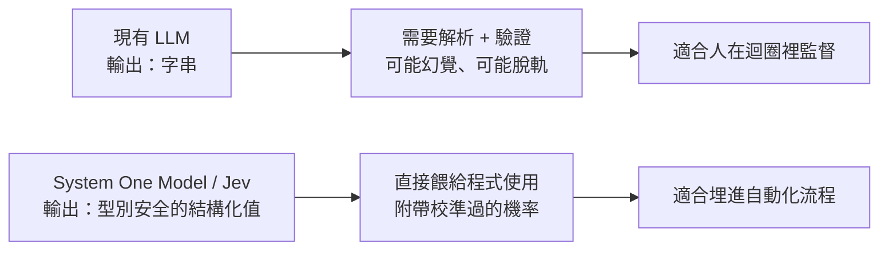

# System One Models 與 Jev：一種「不生成文字」的 AI 模型

這份整理 TypeSafe AI 在 2026 年 9 月發布的 Jev 模型公告，讓你合上網頁後能自己講清楚：它跟 ChatGPT 這類語言模型差在哪、為什麼敢說「不會產生幻覺」、以及它的數據該信幾分。這是課外延伸，不對應任何一門課的進度。

## 目錄

- [1. 這在解決什麼問題](#1-這在解決什麼問題)
- [2. 一句人話](#2-一句人話)
- [3. 用例子看一遍](#3-用例子看一遍)
- [4. 它跟一般大型語言模型差在哪](#4-它跟一般大型語言模型差在哪)
- [5. 技術主張怎麼運作](#5-技術主張怎麼運作)
- [6. 官方提出的證據與該打的折扣](#6-官方提出的證據與該打的折扣)
- [7. 什麼時候能用、什麼時候不能用](#7-什麼時候能用什麼時候不能用)
- [8. 命名由來](#8-命名由來)
- [9. 確認你學會了](#9-確認你學會了)
- [10. 來源](#10-來源)

## 1. 這在解決什麼問題

發文者 Diogo Almeida 是 TypeSafe AI 的創辦人，先前在 OpenAI 參與「讓語言模型學會照指令回答」的研究，也就是後來 ChatGPT 背後的方法之一。他提出的核心疑問是：**模型在聊天這件事上已經超越人類好幾年了，那說好的自動化呢？**

他的診斷是：現有大型語言模型（LLM）的產物是「字串」。字串很萬能——可以是聊天回覆、可以是程式碼，但也可以是幻覺、可以是拒答。軟體要拿來用，就得先解析、再驗證，而且永遠存在「模型突然脫軌」的風險。當 AI 只是在跟人對話時，這沒什麼；但當 AI 要被埋進一段程式邏輯裡、被其他系統依賴時，這種不確定性就是致命的。

TypeSafe 的答案是換一種模型類別：**System One Model（系統一模型）**。它刻意放棄生成文字的能力，改成只輸出「事先定義好結構的決策值」。首款公開模型叫 **Jev**，於公告當日開放早期試用。

## 2. 一句人話

- **System One Model（系統一模型）**：一類刻意不生成文字、只吐出「預先定義好格式的結構化決策」的模型。輸入是非結構化的現況描述，輸出是型別正確、附帶信心度的答案。
- **Jev**：TypeSafe 的第一款系統一模型。官方定位是「一個具備前沿智慧的函式呼叫（function call）」——把混亂的狀態丟進去，拿到型別安全的機率化決策出來。
- **RLCD（Reinforcement Learning for Calibrated Decisions，校準決策的強化學習）**：他們自創的訓練方法，目標不是「人類比較喜歡哪個回答」，而是「模型給出的機率在統計上誠不誠實」。

## 3. 用例子看一遍

想像你在做一個客服工單自動分流系統，需要判斷三件事：這張工單屬於哪個分類、急不急、這位客戶流失風險高不高。

**用一般 LLM 的做法**：寫一段提示詞請模型輸出 JSON，模型一個字一個字生成，你拿到字串後要解析、要檢查欄位名稱有沒有跑掉、要處理它偶爾回「我無法判斷」的情況。整趟花費數秒到數十秒。

**用 Jev 的做法**：你事先把「可能的答案有哪些、結構長什麼樣」定義好，模型一次平行產生所有答案與各自的機率，回應時間落在毫秒級，而且結構保證正確——因為可選的輸出範圍是事先鎖死的，模型在型別上沒有出錯的空間。

官方另外做了兩個玩票性質、但很能說明特性的展示：

- **玩 Doom**：把遊戲狀態以資料結構（文字，不是畫面）餵給模型，讓它即時操作角色，一秒約 10 次查詢，換算成本約每小時 7 美元。重點不是打得比傳統程式機器人好，而是展示「即時反應 + 聽得懂指令」。
- **維基競速（Wikiracing）**：從一個維基百科頁面出發，只能點頁面上的連結，設法走到指定的另一個頁面。每一步要從數百到數千個連結裡挑，很適合展示「在高基數選項下不亂編一個不存在的選項」這件事的價值。

## 4. 它跟一般大型語言模型差在哪

| 面向 | 現有大型語言模型 | System One / Jev |
| --- | --- | --- |
| 訓練目標 | RLHF（人類偏好）／RLVR（可驗證獎勵） | RLCD（校準過的決策機率） |
| 輸入偏重 | 連續的對話訊息 | 結構化的程式狀態 |
| 輸出 | 字串，需自行解析驗證 | 事先定義好的型別安全值 |
| 取樣方式 | 逐字生成，每個字依賴前一個字 | 一次查詢平行產生全部輸出 |
| 輸入計價 | 每百萬 token 約 0.2 至 10 美元 | 每百萬 token 約 0.042 美元 |
| 輸出計價 | 通常約為輸入的 5 倍 | 官方稱免費（低到不值得計費） |
| 端到端延遲 | 前沿模型約 3 至 329 秒 | 約 70 至 500 毫秒 |
| 信心度 | 即使要求自評也常過度自信、前後不一 | 每個輸出都附校準過的機率 |

這張表最值得記住的一行是**取樣方式**：逐字生成是 LLM 昂貴又慢的根源，而「放棄字串」正是 Jev 能快上兩個數量級的原因。速度與成本的優勢不是單純把模型做小，而是架構上換了一條路。

## 5. 技術主張怎麼運作

**為什麼敢說「不會產生幻覺」。** 這句話要精確理解：它指的是**型別層面**不會出錯，不是「答案一定對」。因為所有可能的輸出與結構都在查詢前就宣告好了，模型只是在既有選項上分配機率，不存在「編造一個規格外的欄位或選項」的可能。官方自己也講得很清楚：這個 0% 不是實驗量出來的，而是結構比對本身保證的數學性質——只要有一個反例就能推翻。

**校準（calibration）為什麼重要。** 官方的論點是：一個任務若模型有 95% 的時候做得對，但它從不告訴你自己何時落在那 5%，這個任務就無法自動化。反過來，只要模型能誠實說出「我這次只有六成把握」，外圍程式就能據此決定要不要轉人工。所謂校準，就是「說 80% 把握的那些答案，實際正確率真的接近 80%」。

**「智慧型 if 判斷」的設計思路。** 官方觀察到，最可靠的真實世界流程，往往是把大問題拆成許多彼此獨立的小問題，讓細部行為取決於機率而非一刀切的離散決策，最後才在程式端收斂成分支。模型負責那些「規則寫死會太脆弱」的判斷（分類、路由、評分、抽取），而周圍的程式碼負責限制它的自由度——正是這層約束讓它能被組合成可靠的系統。

## 6. 官方提出的證據與該打的折扣

TypeSafe 這篇公告有個少見的優點：每一段證據後面都自己附了「Nuance（但書）」。整理如下，這也是讀任何廠商 benchmark 時該有的習慣。

| 主張 | 官方提出的但書 |
| --- | --- |
| 同場對比 GPT-5.6 Terra 幾乎全對 | 範例刻意簡化、輸入是短而密集的段落，這種設定對他們的取樣方式有利；唯一分歧的那題（流失風險等級）他們自認本來就模稜兩可 |
| 流程評測（workflow evals）大幅領先，宣稱快 193.6 倍、便宜 444.6 倍 | 這是偏高端的估計值；評測流程雖非為了美化結果而設計，但確實出自自家模型能力團隊之手 |
| 以「最聰明模型的平均」當作標準答案 | 參考答案取 GPT-6 Astra 與 Fable 5.1 的平均，等於把基準偏向 OpenAI 與 Anthropic，可能低估自家與 DeepSeek 模型的相對表現 |
| 幻覺率對比 | LLM 那側的數字來自 OpenRouter，複雜查詢較可能被路由到更好的模型，存在偏差 |
| 0% 型別錯誤 | 非實測，而是結構保證推導出來的 |

流程評測的方法本身值得學：**所有模型跑同一套工作流程，不允許為了某個模型調整外圍框架**，避免用「框架工程」偷偷過擬合。他們也同時測了「不用工作流程、改讓模型在思維鏈裡一次想完」的做法，結果明顯較差。

## 7. 什麼時候能用、什麼時候不能用

**適合系統一模型的場合**：需要分類、路由、評分、抽取、分支的自動化流程；對大量資料做 map-reduce 式的特徵萃取；對延遲敏感的即時應用（百毫秒等級才做得到）；以及當守門員——替別的 LLM 的提示詞、推理過程或輸出做評分、驗證、護欄與越獄偵測。

**仍該用一般 LLM 的場合**：需要人在迴圈裡的任務（聊天機器人、副駕駛、程式代理）；答案可被便宜自動驗證的問題（數學證明、核心程式最佳化），因為 LLM 可以反覆生成與測試直到通過；以及快速做原型展示——字串的彈性讓它非常適合「只要偶爾能動就好」的示範。

**別誤解的兩件事**：

- 「不會幻覺」不等於「不會答錯」。它保證的是格式與選項範圍，不是事實正確性。
- Jev 不是「比較小的 LLM」。它連逐字生成的能力都沒有，不能拿來寫文章或寫程式；把它想成一個很聰明的判斷函式，而不是一個會講話的助理。

另外有個實作限制值得記：Jev 支援的選項基數（cardinality）上限是 255。超過這個數量時（例如維基競速裡動輒上千個連結），得改用「先獨立評分、再明確選擇」的兩階段做法，速度優勢也會因此縮水。

## 8. 命名由來

- **System One（系統一）** 取自康納曼《快思慢想》中「系統一（快速直覺）／系統二（緩慢推理）」的區分。作者也承認「系統一思考」在原書語境裡帶有「容易出錯」的意味，但他們主張這類模型反而能做得比替代方案更可靠。
- **Jev** 取自經濟學家 William Stanley Jevons。他描述過一個現象：蒸汽機變得更省煤之後，煤的總消耗量反而上升（即傑文斯悖論）。TypeSafe 用這個典故表達他們的預期——智慧成本每降一個數量級，就會解鎖多好幾個數量級的新用途。

## 9. 確認你學會了

先自己答，再看參考方向。

1. **用自己的話解釋。** 跟一位只用過 ChatGPT 的朋友說明：Jev 跟 ChatGPT 最根本的差別是什麼？
   - 參考方向：ChatGPT 產出的是字串、一個字一個字生成，萬用但慢、貴，而且可能編造內容；Jev 完全不生成文字，只在事先定義好的選項與結構裡，一次平行輸出帶機率的決策值，所以快上兩個數量級，也不可能吐出格式錯誤的東西。它不是更小的 ChatGPT，是換了一種用途的東西。

2. **對錯判斷。** 「Jev 不會幻覺，所以它給的答案一定是對的。」這句話對嗎？錯在哪？
   - 參考方向：錯。它保證的是型別與結構層面不會出錯——不會編出規格外的欄位或選項，因為可能的輸出在查詢前就被鎖定了。但「在合法選項中選錯一個」仍然完全可能發生，這屬於準確率問題，不是幻覺問題。

3. **應用。** 你看到廠商宣稱自家模型「比對手快 193.6 倍、便宜 444.6 倍」，你要問哪些問題才不會被數字唬住？
   - 參考方向：評測是誰設計的（此處是自家模型能力團隊）？標準答案怎麼來的（此處取兩家對手模型的平均，等於把基準偏向它們）？對手是在什麼設定下被測的（有沒有開推理模式、是否透過中介服務路由）？測試任務是否落在自家訓練分布內？以及這個倍數是平均值還是最佳情況——官方自己就說了這是偏高端的估計。

## 10. 來源

- Almeida, D. (2026). *Introducing System One Models & Jev*. TypeSafe AI Blog. <https://typesafe.ai/blog/introducing-system-one-models-and-jev>
- TypeSafe AI. *Workflow Evals*. <https://evals.typesafe.ai/> — 公開四組流程評測的完整查詢、範例與分歧案例。
- TypeSafe AI. *Documentation*. <https://docs.typesafe.ai/> — 輸出結構如何事先定義。
- Kahneman, D. (2011). *Thinking, Fast and Slow*. Farrar, Straus and Giroux. — 「系統一／系統二」命名出處。
