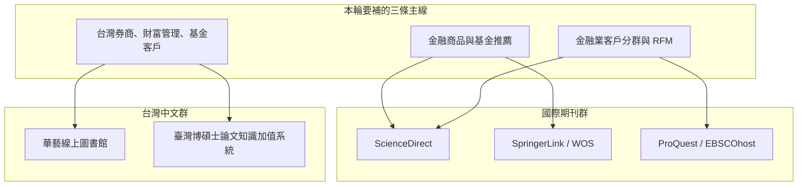
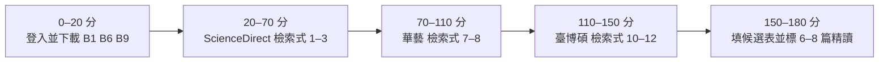

# 北商圖書館 2020 年後文獻補強查詢計畫

本計畫對應論文「應用投資人行為分群與個人化推薦模型於數位券商基金投資服務之研究」，專門規劃如何透過 [北商電子資源整合查詢系統](https://eresources.ntub.edu.tw/) 再查一輪 **2020 年以後**、與「金融商品／基金推薦」及「客戶／投資人分群」相關的文獻。既有 `literature-matrix.md` 已能支撐研究骨架，但 2020 年後可正式引用的期刊與台灣在地論文仍偏少；本輪目標不是再做一次全面回顧，而是在繳交前三章前補齊可寫進第二章的證據。

## 目錄

1. [為什麼要再查一輪](#1-為什麼要再查一輪)
2. [本輪查詢地圖：三條主線、兩個資料庫群](#2-本輪查詢地圖三條主線兩個資料庫群)
3. [如何登入與操作北商電子資源](#3-如何登入與操作北商電子資源)
4. [納入與排除規則](#4-納入與排除規則)
5. [可直接複製的檢索式](#5-可直接複製的檢索式)
6. [第一批已鎖定候選文獻](#6-第一批已鎖定候選文獻)
7. [現有矩陣待下載全文](#7-現有矩陣待下載全文)
8. [三小時執行清單](#8-三小時執行清單)
9. [查回後如何寫進矩陣](#9-查回後如何寫進矩陣)

---

## 1. 為什麼要再查一輪

既有文獻矩陣約 40 筆，骨架已夠：B7 提供金融商品推薦全景，B2 提供基金推薦方法，A6／A7 提供分群方法。但若把「2020 年後、可正式引用、且直接對上本研究」當成篩選條件，目前仍有四個缺口：

| 缺口 | 現況 | 對第二章的影響 |
|---|---|---|
| 基金／金融商品推薦的 2020 後期刊偏少 | 核心只穩 B2、B7；B1、B6 全文未到手；B3／B4 來源品質待查 | 推薦小節容易看起來只靠 1–2 篇 |
| 「分群再推薦」的金融場景證據不足 | A12、E5 是電商／零售；A6 是衍生性商品交易，不是基金 | 難以證明「先分群、再推薦」在金融商品場景合理 |
| 台灣 2020 後在地文獻偏舊或偏問卷 | D／E／G 多為 2020 前或非數位券商平台資料 | 「台灣數位券商場域不足」這句話證據不夠新 |
| 評估指標與冷啟動幾乎沒有專文 | 矩陣待補清單已列 Precision@K、冷啟動，但尚未補進 | 第三章評估設計缺少文獻支撐 |

本輪因此只查三件事：**金融商品／基金推薦**、**金融業客戶分群（尤其 RFM）**、**台灣券商／財富管理／基金客戶分群**。股價預測、新聞情緒選股、完整 robo-advisor 報酬最佳化，一律不當成本輪主力。

---

## 2. 本輪查詢地圖：三條主線、兩個資料庫群

先建立查詢 Mental Model：同一組研究問題，用「國際期刊」與「台灣中文」兩套資料庫分開搜，避免中英文關鍵字混在同一檢索式裡互相稀釋。



三條主線各自要回答的問題不同：

| 主線 | 要回答的問題 | 優先寫進矩陣的類別 |
|---|---|---|
| 金融商品與基金推薦 | 2020 後基金／金融商品推薦怎麼做？用什麼資料、什麼評估指標？ | B 類 |
| 金融業客戶分群與 RFM | 銀行、財富管理、數位金融如何把 RFM／交易行為做成可解釋分群？ | A 類（必要時 C 類） |
| 台灣券商／財富管理／基金客戶 | 台灣有沒有 2020 後、用真實客戶資料做分群或商品推薦的論文？ | D／E／F 類 |

課堂已讀、但尚未列入正式矩陣的文獻，本輪一併升級評估：Chiou-Wei & Lee（2024）基金 KL-KM 推薦、Ni（2025）金融商品分群綜述。前者建議優先升為 B 類；後者僅作方法比較背景，來源層級較低。

---

## 3. 如何登入與操作北商電子資源

入口為 [https://eresources.ntub.edu.tw/](https://eresources.ntub.edu.tw/)。圖書館說明見 [校外連線電子資源 FAQ](https://library.ntub.edu.tw/wSite/ct?ctNode=798&mp=1&xItem=2890) 與 [線上學習不間斷](https://library.ntub.edu.tw/wSite/ct?ctNode=756&mp=1&xItem=10237)。

| 步驟 | 操作 |
|---|---|
| 1. 登入 | 學生帳號為學號，密碼為身分證後四碼 |
| 2. 選資料庫 | 左側「依資源分類勾選查詢」，或右上角「資料庫」清單搜尋資料庫名稱 |
| 3. 先查後載 | 先用整合查詢或單一資料庫找到題名／DOI，再點全文；校外通常不必另設 VPN |
| 4. 找不到全文 | 記下 DOI、作者、年份，改走館際合作或國圖資料快送 |

本輪建議優先使用的資料庫：

| 資料庫 | 在本輪的用途 | 建議搜尋介面 |
|---|---|---|
| ScienceDirect | 找 *Expert Systems with Applications*、*Financial Innovation* 等同領域期刊 | Advanced Search，年份 2020–2026 |
| SpringerLink | 下載 B6、B9；找 Applied Intelligence、Multimedia Tools and Applications | 用 DOI 最準 |
| Web of Science | 確認期刊層級、往後追引用（cited by） | 用題名或 DOI 查，再看 Highly Cited / 近期引用 |
| 華藝線上圖書館 | 台灣期刊與學位論文全文 | 中文關鍵字 + 出版年 2020 以後 |
| 臺灣博碩士論文知識加值系統 | 台灣碩論方法與章節寫法 | 關鍵字 + 論文出版年 2020–2026 |
| ProQuest / EBSCOhost | 補商管、金融行銷、財富管理分群 | 英文 Boolean，Document type = Article / Dissertation |
| EndNote | 查回後立刻匯入，避免之後 APA 格式再重做 | 與資料庫匯出並行 |

若某篇顯示「機構未訂閱」，不要改用品質不明的免費站。改走三條備援：開放取用版本（MDPI、Frontiers、PMC）、ResearchGate 向作者索取、圖書館館際合作。

---

## 4. 納入與排除規則

查詢時用同一套規則，避免把「看起來像金融推薦」但實際是股價預測的論文寫進第二章。

**納入（必須同時符合）**

1. 出版年 **2020 年（含）以後**。
2. 主題至少命中其一：金融商品／基金／財富管理推薦、金融業或投資人分群、RFM 用於銀行／券商／財富管理。
3. 來源為同儕審查期刊、正式會議論文、台灣學位論文，或金管會／IOSCO／CFA 等機構報告。
4. 能直接支撐本研究的「分群」、「推薦概念驗證」或「台灣數位券商場域」。

**排除**

- 純股價／匯率預測、新聞情緒選股、高頻交易。
- 一般電商 RFM，且完全沒有金融、銀行、投資或財富管理場景（已有 A7、E5，不必再堆電商案例）。
- ResearchGate 預印本、部落格、沒有正式出版資訊的 PDF。
- 完整 robo-advisor 投資組合最佳化，且完全不討論分群或個人化商品推薦。
- 2020 年以前文獻。唯一例外：為了解釋經典方法（如 Huang 1998 K-prototypes）才可補，不佔本輪配額。

**本輪配額（配合 10/2 前三章）**

| 類別 | 建議新增篇數 | 原因 |
|---|---|---|
| B 類基金／金融推薦 | 4–6 篇 | 目前 2020 後可引用核心太少 |
| A 類金融分群／RFM | 3–4 篇 | 把分群從電商場景拉回金融業 |
| 台灣 D／E／F | 2–3 篇 | 補強「在地場域不足」 |
| 評估指標／冷啟動 | 1–2 篇 | 支撐第三章，不必寫成長文 |

合計約 **10–15 篇候選**，最後精讀 **6–8 篇**即可。不必追求把 B7 的 65 篇全部找齊。

---

## 5. 可直接複製的檢索式

以下檢索式已對本研究題目收斂。使用時請一律加上 **Publication year: 2020–2026**，並優先勾選 **Article / Review**。

### 5.1 ScienceDirect／Springer／WOS：基金與金融商品推薦

**檢索式 1｜基金推薦（最優先）**

```text
("mutual fund recommendation" OR "fund recommendation" OR "personalized fund recommendation")
AND (investor OR customer OR user)
AND (2020 OR 2021 OR 2022 OR 2023 OR 2024 OR 2025 OR 2026)
```

**檢索式 2｜金融商品推薦 + 分群**

```text
("financial product recommendation" OR "financial services recommendation")
AND (clustering OR segmentation OR "K-means" OR RFM)
```

**檢索式 3｜行為資料／點擊／瀏覽 + 金融推薦**

```text
("clickstream" OR "web behavior" OR "digital behavior" OR "browsing behavior")
AND (fund OR "financial product" OR brokerage OR "wealth management")
AND (recommendation OR clustering OR segmentation)
```

**檢索式 4｜評估指標（第三章用）**

```text
("Precision@K" OR "Recall@K" OR NDCG OR "cold start")
AND ("financial product recommendation" OR "fund recommendation")
```

### 5.2 ScienceDirect／ProQuest：金融業客戶分群與 RFM

**檢索式 5｜銀行／財富管理 RFM 分群**

```text
(RFM OR "recency frequency monetary")
AND ("K-means" OR clustering OR segmentation)
AND (bank OR banking OR "wealth management" OR brokerage OR investor)
```

**檢索式 6｜投資人行為分群**

```text
("investor segmentation" OR "investor clustering" OR "investor profiling")
AND ("mutual fund" OR brokerage OR "digital banking" OR FinTech)
```

### 5.3 華藝：台灣期刊與學位論文

**檢索式 7**

```text
(基金推薦 OR 金融商品推薦 OR 個人化推薦)
AND (投資人 OR 客戶分群)
出版年：2020-2026
```

**檢索式 8**

```text
(RFM OR K-means OR 群集分析 OR 客戶分群)
AND (券商 OR 財富管理 OR 基金 OR 證券)
出版年：2020-2026
```

**檢索式 9**

```text
(機器人理財 OR 數位券商 OR 數位理財)
AND (投資人 OR 採用意圖 OR 信任)
出版年：2020-2026
```

### 5.4 臺灣博碩士論文知識加值系統

**檢索式 10**

```text
基金 AND (推薦系統 OR 個人化推薦) AND 論文出版年>=2020
```

**檢索式 11**

```text
(投資人分群 OR 客戶分群) AND (券商 OR 基金 OR 財富管理) AND 論文出版年>=2020
```

**檢索式 12**

```text
RFM AND (金融 OR 銀行 OR 證券) AND 論文出版年>=2020
```

查學位論文時，優先看：**是否使用真實交易／平台資料**、是否有分群後再對應服務或推薦、是否為台灣券商或銀行場景。純問卷、純 TAM 採用意圖，最多當 F 類背景，不佔 B 類名額。

---

## 6. 第一批已鎖定候選文獻

下列論文已先以公開書目鎖定，**尚未全部讀全文、也尚未寫進正式矩陣**。請用北商帳號以 DOI／題名查全文，通過第 4 節規則後再納入。

### 6.1 建議升為正式 B 類：基金／金融商品推薦

| 暫代號 | 文獻 | 年份 | 為何值得查 | 學校資料庫 |
|---|---|---|---|---|
| B-cand-1 | Chiou-Wei, S.-Z., & Lee, Y.-T. *Application of KL distance-based intelligent recommendation method to fund recommendation for users with investment behavior in Asia Region.* *Heliyon*, 10(12), e32959. [DOI](https://doi.org/10.1016/j.heliyon.2024.e32959)／[PMC](https://pmc.ncbi.nlm.nih.gov/articles/PMC11252857/) | 2024 | 課堂已精讀；亞洲基金購買紀錄 + K-medoids 分群推薦，最接近「分群輔助基金推薦」 | ScienceDirect；開放取用 |
| B-cand-2 | Sharaf, M., Hemdan, E. E.-D., El-Sayed, A., & El-Bahnasawy, N. A. *A survey on recommendation systems for financial services.* *Multimedia Tools and Applications*, 81(12), 16761–16781. [DOI](https://doi.org/10.1007/s11042-022-12564-1) | 2022 | 即矩陣 **B9**，補 DOI 後可正式引用，與 B7 形成 2022／2025 兩篇綜述 | SpringerLink |
| B-cand-3 | Pérez-Pons, M. E., et al. *OCI-CBR: A hybrid model for decision support in preference-aware investment scenarios.* *Expert Systems with Applications*, 211, 118568. [DOI](https://doi.org/10.1016/j.eswa.2022.118568) | 2023 | 與 B1 同期刊；混合推薦＋投資人偏好，B7 亦引用 | ScienceDirect |
| B-cand-4 | Mehta, D., et al. *Fund2Vec: Mutual funds similarity using graph learning.* ACM ICAIF. [DOI](https://doi.org/10.1145/3490354.3494381)／[arXiv](https://arxiv.org/abs/2106.12987) | 2021 | 基金相似度可用於內容導向／熱門推薦以外的 baseline 討論 | ACM／WOS；arXiv 可先讀 |
| B-cand-5 | Shen, Q.-Y., Shi, Y., & Shao, Y.（作者全名已於 2026-09-21 用 Semantic Scholar 確認）*Research on financial recommendation algorithm based on user interest evolution and big data.* IEEE EEBDA, 764–769. [DOI](https://doi.org/10.1109/EEBDA53927.2022.9744929) | 2022 | B7 點名 DIEN 用於基金／金融商品興趣演化，可對照「行為序列」；結合協同過濾＋時間序列（七日年化利率等時效因子）＋ DIEN 注意力機制追蹤使用者興趣演化 | IEEE proxy 卡住，已改用 Semantic Scholar 摘要佐證，全文未取得 |
| B-cand-6 | Sudha, D., et al. *Study of an adaptive financial recommendation algorithm using big data analysis and user interest pattern with fuzzy K-means algorithm.* *International Journal of Computational Intelligence Systems*. [DOI](https://doi.org/10.1007/s44196-024-00719-x) | 2024 | 模糊 K-means 分群＋推薦，並使用 Precision@K、Recall@K，直接支撐評估指標 | SpringerLink |

### 6.2 建議升為正式 A／C 類：金融業分群

| 暫代號 | 文獻 | 年份 | 為何值得查 | 學校資料庫 |
|---|---|---|---|---|
| A-cand-1 | Salo, L. *Leveraging segmentation to improve client understanding... A case study in wealth management.* Aalto University Master's thesis. [紀錄頁](https://aaltodoc.aalto.fi/items/ebf942d7-2a95-4b5a-bd74-645bc9746c15) | 2025 | RFM+B（加入資產餘額）＋ K-means，財富管理場景比電商 RFM 更接近本研究 | ProQuest／學校學位論文系統 |
| A-cand-2 | Arayasaeng, C., Jongsawat, N., & Tungkasthan, A.（作者已於 2026-09-21 用 Semantic Scholar 確認）*Using RFM-R analysis for effective customer segmentation in bank marketing.* IEEE ICTKE. [DOI](https://doi.org/10.1109/ictke58576.2023.10401701) | 2023 | 數位銀行 RFM 擴充＋ K-means、Elbow、Silhouette；泰國某商銀 2022 全年 685,205 筆交易、50,497 名客戶真實資料 | IEEE proxy 卡住，已改用 Semantic Scholar 摘要佐證，全文未取得 |
| A-cand-3 | Ganar, C., & Hosein, P.（作者已於 2026-09-21 用 Semantic Scholar 確認）*Customer segmentation for improving marketing campaigns in the banking industry.* IEEE ACMLC. [DOI](https://doi.org/10.1109/acmlc58173.2022.00017) | 2022 | RFM＋K-means／K-modes＋AHP／CLV，並用 Decision Tree／XGBoost 預測客戶轉線上銀行行為（K-Modes+XGBoost 準確率 96.1%），可對照「分群後再做行銷／服務」 | IEEE proxy 卡住，已改用 Semantic Scholar 摘要佐證，全文未取得 |
| A-cand-4 | ⚠️ **作者資訊已修正（2026-09-21 查證）**：Aliyev, M., Ahmadov, E., Gadirli, H., Mammadova, A., & Alasgarov, E.（原計畫誤植為「Imanov, G.」）*Segmenting Bank Customers via RFM Model and Unsupervised Machine Learning.* [arXiv:2008.08662](https://arxiv.org/abs/2008.08662) | 2020 | 亞塞拜然某私人銀行真實客戶資料，RFM＋多種分群演算法比較 | ✅ 開放取用，摘要已取得；仍未見正式出版版本 |

### 6.3 建議升為正式 D／E 類：台灣在地 2020 後

| 暫代號 | 文獻 | 年份 | 為何值得查 | 學校資料庫 |
|---|---|---|---|---|
| E-cand-1 | 《運用機器學習方法推廣綜合券商大財管業務》。《管理資訊計算》。 [華藝](https://www.airitilibrary.com/Article/Detail/P20140403001-202206-202208150002-202208150002-31-58) | 2022 | 台灣綜合券商財富管理客戶 K-means 分群＋分類，最接近「台灣券商真實客戶分群」 | 華藝 |
| E-cand-2 | 溫國抆（2024）。《結合關聯法則與機器學習演算法於適性化產品推薦機制─以零售業 RFM 衍伸模型為基礎》。中原大學碩士論文。 [華藝](https://www.airitilibrary.com/Article/Detail/U0017-1812202411462615) | 2024 | 2024 年台灣碩論，RFM 衍伸＋分群＋推薦；場景是零售，只適合作方法對照，不宜當金融核心 | 華藝；注意授權年限 |
| D-cand-1 | 以 NDLTD 檢索式 10–12 現場篩選 | 2020–2026 | 公開搜尋不易一次找齊 2020 後基金推薦碩論，必須用學校帳號進臺博碩篩 | 臺博碩 |

### 6.4 僅作背景、暫不升正式核心

| 文獻 | 原因 |
|---|---|
| Ni（2025）金融商品推薦集群分析綜述 | 課堂已讀，可輔助演算法比較；會議綜述層級低於 B7 |
| FundRecLLM（2023） | 說明本研究不做 LLM 推薦的邊界即可 |
| IRJET（2023）*Clustering models for mutual fund recommendation* | 學生研討／期刊層級偏低，不建議當核心引用 |
| 黃先林（2019）RFMF 公募基金用戶分群 | 題材極接近，但 **2019 年**，本輪不納入 |

---

## 7. 現有矩陣待下載全文

本輪查詢時，請同步用同一組帳號把「已經知道、但還沒全文」的文獻載下來。這比再找 10 篇新論文更能立刻寫進第二章。

| 編號 | 文獻 | 建議路徑 |
|---|---|---|
| B1 | Chou, Chen & Huang（2021/2022）GraphDCF，*Expert Systems with Applications* | ScienceDirect 搜 DOI [10.1016/j.eswa.2021.116311](https://doi.org/10.1016/j.eswa.2021.116311) |
| B6 | Hsu, Chen, Chou & Huang（2022）可解釋共同基金推薦，*Applied Intelligence* | SpringerLink 搜 DOI [10.1007/s10489-021-03136-1](https://doi.org/10.1007/s10489-021-03136-1) |
| B9 | Sharaf et al.（2022）金融服務推薦綜述 | SpringerLink 搜 DOI [10.1007/s11042-022-12564-1](https://doi.org/10.1007/s11042-022-12564-1) |
| A5 | 東海大學 RFM 分群暨商品推薦碩論 | 全文若仍受限，走館際合作，論文編號 `110THU01026098` |
| E2 | 台科大 RFM 顧客分群碩論 | 館際合作或 NTUST 電子論文系統，編號 `109NTUS5121030` |
| E5 | 政大 RFM＋購物籃碩論 | 華藝已可查，補正式全文即可 |

B1、B6 是台灣基金推薦同一研究群，若學校訂閱能下載，第二章「基金推薦」會立刻比現在厚。這兩篇的優先級高於再找新的深度學習論文。

---

## 8. 三小時執行清單

配合目前前三章時程，不建議把這輪做成新的系統性文獻回顧。建議一次坐下來完成下列順序：



1. **先下載已知名篇**：B1、B6、B9。成功與否直接決定第二章基金推薦能寫多深。
2. **英文主搜 ScienceDirect**：只看 Abstract 是否同時出現「fund / financial product」與「recommendation / clustering」。命中後存 PDF、記 DOI。
3. **中文主搜華藝＋臺博碩**：重點找台灣券商、財富管理、基金客戶；零售 RFM 最多留 1 篇當方法對照。
4. **收斂精讀名單**：從候選裡選 6–8 篇，標準是「能讓缺口那一句話變得有出處」，不是方法更新潮。
5. **暫不精讀**：GNN／LLM、深度點擊序列、股價預測。這些最多在研究限制或未來研究提一句。

### 8.1 查詢執行進度紀錄（依實際操作 session 更新）

因單次可用時間有限，三小時清單實際拆成 6 個 15–30 分鐘小段落執行，見下表；每次接續前先看本表，不用重新摸索介面問題。

| 段落 | 內容 | 狀態 | 備註 |
|---|---|---|---|
| ① 下載已知名篇 B1/B6/B9 | 20 分鐘 | 🟡 進行中（2026-09-21：B1 ✅ 已取得全文，B6 ⚠️ 確認無法取得改用摘要，B9 待查——預期同樣卡 Springer 機構登入） | 見下方操作紀錄 |
| ② ScienceDirect 檢索式 1 | 15–20 分鐘 | 🟡 部分完成（B-cand-3 確認 Open Access 但下載卡住未成功） | |
| ③ ScienceDirect 檢索式 2–3 | 20–25 分鐘 | ⏳ 未開始 | |
| ④ 華藝 檢索式 7–8 | 25–30 分鐘 | 🟢 已完成候選清單中兩篇（E-cand-1 全文✅、E-cand-2 摘要，embargo至2029） | 見 2026-09-21 操作紀錄 |
| ⑤ 臺博碩 檢索式 10–12 | 25–30 分鐘 | 🟡 部分完成：跑過檢索式10，找到 D5（王怡2023，高度相關，摘要已取得，全文需另行註冊會員） | 見 2026-09-21 操作紀錄；檢索式11、12 尚未跑 |
| ⑥ 收斂精讀名單 | 15 分鐘 | ⏳ 未開始 | |

**2026-09-20 操作紀錄：**

- 已成功登入 `https://eresources.ntub.edu.tw/`。
- 嘗試用首頁「整合查詢」框搜尋 B1（GraphDCF，DOI `10.1016/j.eswa.2021.116311`），直接貼 DOI 查詢**無結果**；改搜標題關鍵字「GraphDCF mutual fund recommendation」有 2 筆命中，但列表顯示皆為「(無題名)」，只看得到命中的資料庫名稱（ScienceDirect Online (SDOL)、Journal Citation Reports），看不到文章標題或下載連結——**整合查詢介面目前只索引到資料庫層級，不適合用來直接找特定文章全文**。
- **下次改用更直接的路徑**：從首頁「熱門電子資料庫」清單直接點進 **ScienceDirect Online (SDOL)**，進入 ScienceDirect 官方介面後，直接用 DOI 或標題在它自己的搜尋框查詢，應可看到完整書目與下載按鈕。B6（Applied Intelligence，DOI `10.1007/s10489-021-03136-1`）建議改點「SpringerLink」資料庫入口，同樣以 DOI 直接查。
- B1、B6、B9 三篇皆尚未確認是否成功取得全文，下次從 ScienceDirect／SpringerLink 官方介面重新查詢即可接續，不需重跑整合查詢。

**2026-09-21 操作紀錄：**

- 改用建議路徑成功：首頁「熱門電子資料庫」→ ScienceDirect Online (SDOL) → 點資源網址進入 `eresources.ntub.edu.tw:4023`（ScienceDirect proxy，頁首顯示「Brought to you by: National Taipei University of Business」即代表已認證）→ 在 ScienceDirect 自己的搜尋框貼 DOI，一次就找到 B1。
- **B1 已取得全文** PDF，存於 `literature/downloads/B1-chou-chen-huang-2022-graphdcf.pdf`（已加入 `.gitignore`，不進版本控制，僅供個人寫作參考）。下載訣竅：點「View PDF」後會另開分頁到 `pdf.sciencedirectassets.com` 的簽章連結（5分鐘有效、無法用 curl 直接抓，會被防護頁擋下），改用瀏覽器內 Cmd+S 存成本機檔案即可成功。
- **B6 改用 SpringerLink 查詢**：首頁搜「SpringerLink」→ 資源網址進入 `eresources.ntub.edu.tw:3939`（Springer Nature Link proxy）→ 用 DOI 查詢一次命中。但文章頁面顯示「Log in via an institution」（點下去會跳出 proxy、導到 Springer 自己的 Shibboleth WAYF 聯合登入頁 `wayf.springernature.com`，需另外選校名走一次校園 SSO）或「Buy article PDF €39.95」，**確認學校未提供此篇之直接全文存取**，已定案改用公開摘要佐證，不再嘗試取得全文。
- **重要心得**：ScienceDirect（SDOL）跟 SpringerLink 兩個 proxy 的認證機制不同——SDOL 進去就直接放行全文；SpringerLink 即使走 proxy 入口，個別文章仍可能要求走 Shibboleth 機構登入才能解鎖，不是所有 SpringerLink 文章都能像 ScienceDirect 一樣直接存取，需視個別期刊訂閱範圍而定。
- B9（Sharaf et al. 2022，*Multimedia Tools and Applications*，DOI `10.1007/s11042-022-12564-1`）尚未查詢，因也是 SpringerLink 系統，下次查詢時應提早預期可能同樣遇到機構登入卡關，並先問使用者是否要花時間走 Shibboleth 登入。
- B-cand-3（Pérez-Pons et al. 2023, OCI-CBR, DOI `10.1016/j.eswa.2022.118568`）**確認為 ScienceDirect Open Access 文章，但下載卡住**：點 View PDF 後停留在 proxy 的 pdfft 跳轉頁不會繼續解析（跟 B1 不同，B1 會在 2-3 秒內跳到 pdf.sciencedirectassets.com 的簽章下載頁），Cmd+S 存檔對話框沒有正確跳出；直接 curl 抓公開網址一樣被防護頁擋下。使用者手動下載也未成功。**2026-09-21 決定跳過，改用摘要佐證**（但摘要抓取也因 403 失敗，暫無內容，之後可再嘗試 Google Scholar 快取或直接向作者索取）。
- **IEEE Xplore proxy 測試失敗**：首頁點「IEEE Xplore 線上資料庫」→ 進入 `eresources.ntub.edu.tw:3609/Xplore/home.jsp`，頁面卡在載入圈圈超過 10 秒無反應（測試 A-cand-2、A-cand-3、B-cand-5 三篇 IEEE 文獻皆未能查詢）。**下次建議直接改查該文獻是否有 arXiv 或作者個人網站的開放版本**，不一定要透過 IEEE proxy。
- **開放取用文獻改走公開網路，效率更高**：B-cand-1（Chiou-Wei 2024, Heliyon）、B-cand-4（Fund2Vec, arXiv）、A-cand-4（RFM銀行分群, arXiv）三篇皆為開放取用，直接用 WebFetch 查 DOI／PMC／arXiv 連結即可取得完整摘要，不需要透過圖書館 proxy，且不會卡在登入或防護頁問題。**下次遇到候選文獻先查是否為 Open Access／arXiv，若是就優先走公開網路而非圖書館系統**。

**2026-09-21 華藝與臺博碩操作紀錄：**

- **華藝（airitilibrary.com）體驗最順**：直接用瀏覽器開文章公開網址（不需經過 eresources 首頁搜資料庫），標示「OpenAccess」的文章有「全文下載」按鈕，點擊後會跳出檔名確認對話框，確認後直接下載到系統 `~/Downloads/`，全程不需登入。**E-cand-1（許仲廷 2022，台灣券商財管K-means分群）用此方式成功下載全文**，改名為 `E6`／`E-cand-1-xu-2022-ml-securities-wealth-management.pdf`。
- **E-cand-2（溫國抆 2024，中原大學碩論）確認全文 embargo 至 2029/04/10**，頁面會明確標示開放下載日期，此類論文無法透過任何方式提前取得全文，只能引用公開摘要（已取得完整中英文摘要）。
- **臺博碩（ndltd.ncl.edu.tw）需先過圖形驗證碼**（真人手動輸入，不可自動化），之後用簡易檢索「基金 推薦系統」（對應原檢索式10）一次找到 5 筆結果，其中 **D5（王怡 2023，東吳大學，「推薦系統之應用——以共同基金電子交易平台為例」）與本研究場域幾乎完全吻合**，摘要提到「國內也有五家代理銷售共同基金的電子交易平台」，可直接引用進第一章市場背景。**全文下載需另外註冊臺博碩免費會員帳號**（帳號註冊需使用者本人操作，AI 不可代為建立帳號），本次僅取得摘要。
- 檢索式10 找到的其他候選（#1 中央大學基金持股序列推薦系統、#2 陽明交通大學知識圖譜基金推薦、#4 交通大學深度學習基金推薦）多數也是 embargo 或需會員登入，尚未逐一確認，下次可繼續查。
- 檢索式11（投資人分群 OR 客戶分群）、檢索式12（RFM AND 金融）尚未執行。

**2026-09-21 IEEE 候選文獻改走 Semantic Scholar 公開 API 操作紀錄：**

- 使用者無圖書館帳號可登入 Shibboleth（B9）與 IEEE Xplore proxy，本次改走完全不需登入的路徑：**Semantic Scholar 公開 Graph API**（`https://api.semanticscholar.org/graph/v1/paper/DOI:<doi>?fields=title,abstract,authors,year,venue`），直接用 DOI 查詢，三篇 IEEE 候選文獻皆一次成功取得完整摘要與正確作者名單，**全程不受 IEEE proxy 卡住問題影響**。
- **A-cand-2**：確認作者為 Arayasaeng, C., Jongsawat, N., Tungkasthan, A.；摘要確認資料來源是泰國某商銀 2022 年全年 685,205 筆交易、50,497 名客戶，真實交易資料含金額（RFM-R 的 R = 收益），比一般 RFM 更貼近本研究「用真實交易資料分群」的訴求。
- **A-cand-3**：確認作者為 Ganar, C., Hosein, P.；摘要確認除 RFM+K-means 分群外，還用 AHP 算 CLV，並以 Decision Tree／XGBoost 預測客戶轉線上銀行行為，K-Modes+XGBoost 準確率達 96.1%——這篇比原計畫預期的內容更豐富，「分群後預測轉換行為」的角度可對照本研究「分群後推薦」的邏輯。
- **B-cand-5**：確認作者全名為 Shen, Qiu-Yang, Shi, Yuliang, Shao, Yong；摘要確認方法為協同過濾 + 時間序列（含七日年化利率等時效因子）+ DIEN 注意力機制，與 B7 綜述點名的方法一致。
- **三篇仍只有摘要、未取得全文**（Semantic Scholar 只提供摘要層級，不提供 PDF），若之後仍要全文，下次可請使用者本人親自登入 IEEE Xplore proxy 或走館際合作；目前摘要層級的資訊已足夠支撐第二章「金融業分群」與「基金推薦興趣演化」兩小節的佐證用途。
- **心得**：日後遇到 IEEE／Springer 等 proxy 卡住或需要機構帳號的候選文獻，**優先試 Semantic Scholar Graph API 用 DOI 查詢**，比重複嘗試 proxy 或找 ResearchGate（常回傳 403）更快、更穩定。

---

## 9. 查回後如何寫進矩陣

請維持 `literature-matrix.md` 為唯一正式清單，不要另開第二份矩陣。建議新增時沿用現有編號規則：

| 情況 | 編號方式 |
|---|---|
| 基金／金融推薦 | 接在 B9 之後：B10、B11… |
| 金融分群／RFM | 接在 A12 之後：A13、A14… |
| 台灣券商／財管 | 接在 D4／E5／F7 之後 |

每篇至少填：作者、年份、來源、核心方法、與本研究關聯、優先級、DOI 或華藝／NDLTD 連結。來源品質未確認前，優先級先標「中／待查證」，不要直接寫進 Proposal 草稿當已確認引用。

精讀後摘要仍放 `literature/reading-summaries/`，檔名沿用 `編號-作者-年份-主題-reading-summary.md`。課堂已有摘要的 Chiou-Wei（2024），升正式代號時不必重寫全文，把課堂摘要改掛正式編號即可。
